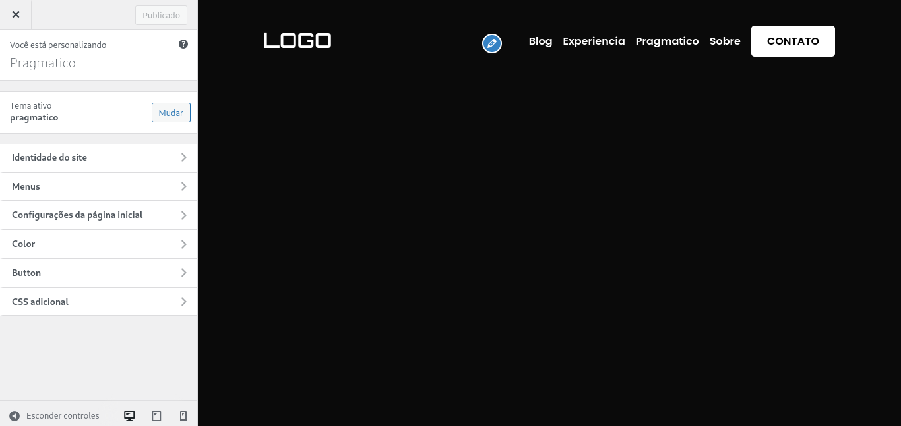
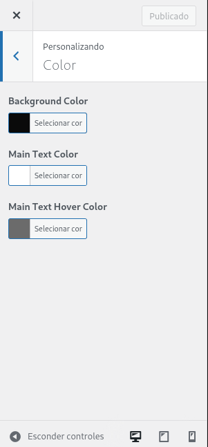

# Cores

Nesta seção da documentação, você encontrará informações sobre como ajustar as
cores do tema.

---

## Cor de Fundo

Para alterar a cor de fundo padrão do tema, acesse o painel administrativo do
WordPress e vá em **Aparência > Personalizar**.

Em seguida, clique na opção **Cores**.

Utilizando a paleta de cores, você pode escolher a nova cor de fundo para o
tema. Ao finalizar, clique em **Publicar** para confirmar a alteração.
