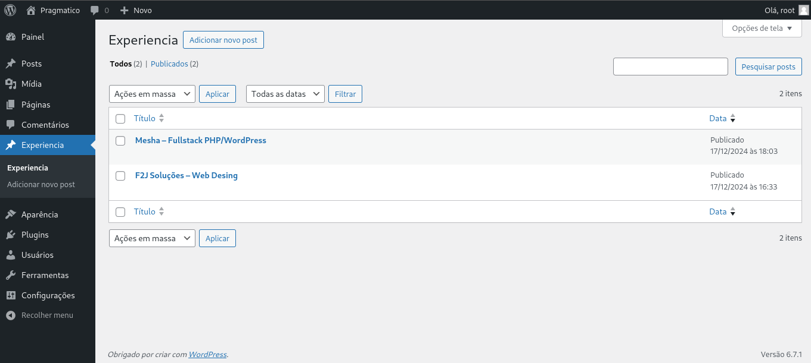
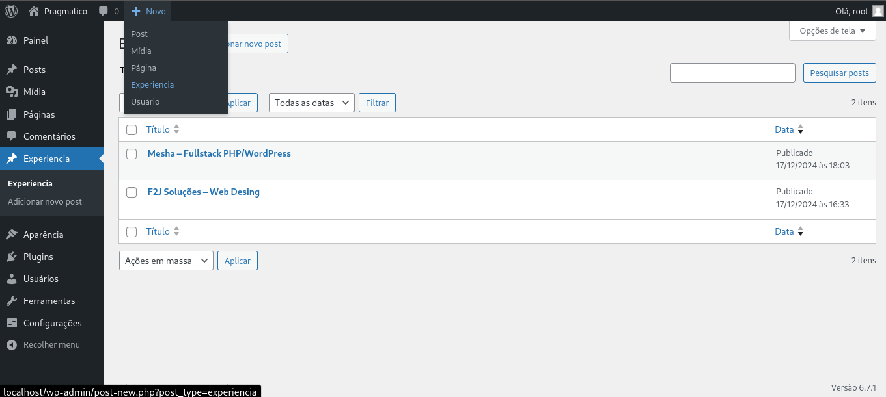
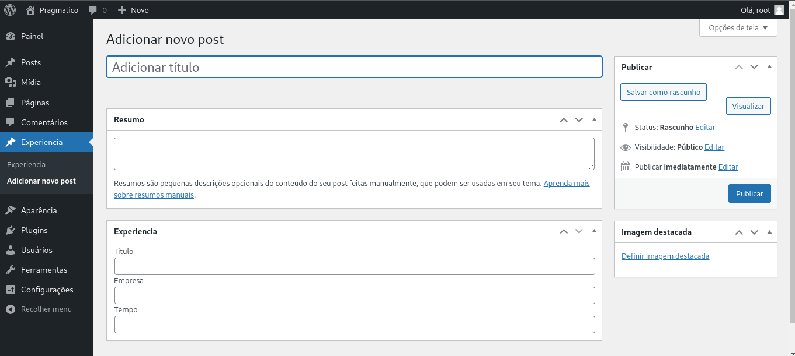
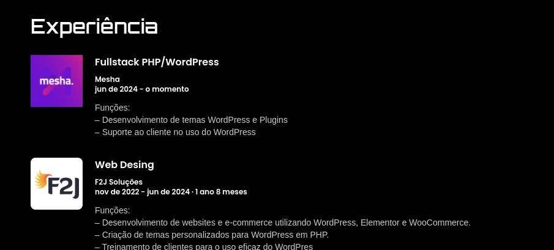

## Posts e seus tipos

Aqui, vou tratar dos posts e seus tipos, como realizar o cadastro, edição de posts, entre outros processos.

### Experiência

Post utilizado para cadastrar experiências profissionais.

#### Cadastrar uma nova experiência

No painel administrativo do WordPress, vá em **Experiência** e clique em **Novo Post**:

Ou clique em **Novo** e depois em **Experiência**, para cadastrar uma nova experiência:

Na página que se abre, é possível realizar o cadastro da nova experiência, podendo adicionar:

- Título da experiência
- Descrição/resumo da experiência
- Cargo ou título profissional
- Nome da empresa
- Tempo de trabalho
- Logo da empresa, como imagem de destaque

Aqui está um exemplo de como a experiência cadastrada ficará na tela inicial:

