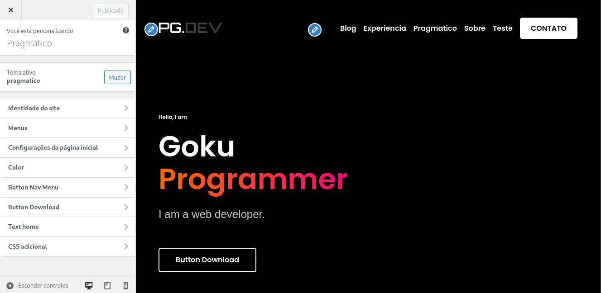
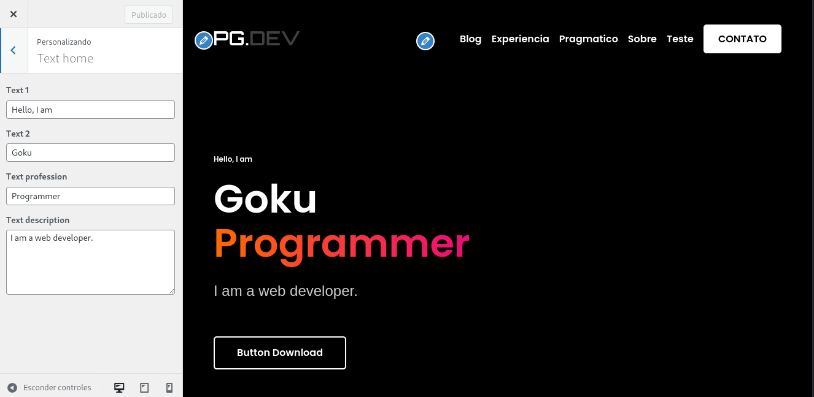

# Configurações de Textos

O site possui vários textos fixos, nessa área vamos tratar das possibilidades
de alterações do texto

---

## Home

Como alterar os textos da página home

No painel administrativo vá em Aparência > Personalizar

Clique em 'Text Home' para visualizar um conjunto de caixas de opções. Através
delas, você poderá alterar os textos da página inicial.

