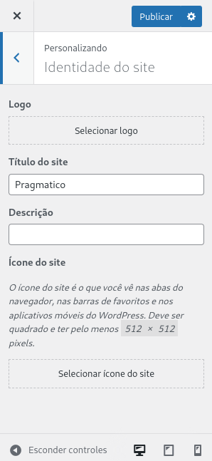
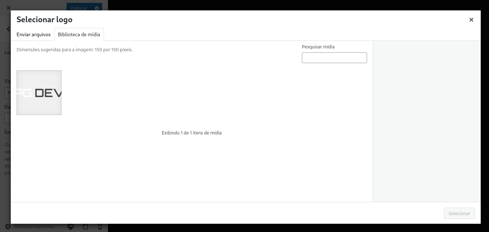

# Configurações do Tema

Aqui você encontrará informações sobre as configurações do tema.

Essas são as configurações mais básicas e comuns de temas WordPress.

---

## Alterar Logo

Para alterar a logo do tema, acesse o painel administrativo do WordPress e vá
em **Aparência > Personalizar**.

Em seguida, clique na opção **Identidade do Site**.

Clique em **Selecionar logo** para alterar a logo do site. Uma caixa de opções
se abrirá, e por meio dela você pode escolher o arquivo de imagem que deseja
usar.

Selecione a logo do site e clique em **Publicar** para confirmar a alteração.

> **Nota**: É recomendado que as dimensões da logo sejam de 141 x 24 px.
